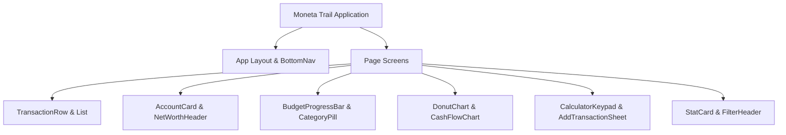

# Moneta Trail — Design Context & Extraction Specification

> **Project Name:** Moneta Trail  
> **Source Stitch Project:** `projects/11104253887371826917` (Mobile Target, 21 Screen Instances)  
> **Extraction Date:** August 10, 2026  
> **Token Source File:** [`design-tokens.json`](file:///c:/Users/i8o8i/OneDrive/Desktop/Moneta-Trail/design-tokens.json)

---

## 1. Project Screen & Component Catalog (21 Screens / Instances)

Below Is The Complete Extraction Of Every Screen And Component Instance Pulled From The Stitch Project Dataset.

| # | Screen Name | Proposed Route | Route Purpose | Interactive Elements |
| :-: | :--- | :--- | :--- | :--- |
| **1** | **Records Dashboard** | `/records` (Home) | Primary Transaction History Feed, Account Overview, and Quick Spending Log. | Search Input Bar, Category Filter Pills (`All`, `Food`, `Bills`, `Shopping`), Transaction Item Rows (Tap to View Details), Month Selector Dropdown, Floating Action Button (`+` Add Transaction), Top Header Profile Avatar Button. |
| **2** | **Records Dashboard (Alt Dark)** | `/records?theme=dark` | Alternative Dark-Mode Presentation for Transaction Tracking. | Search Bar, Filter Chips, Transaction List Items, Date Range Selector, Top Settings Gear Icon (`settings`), Bottom Navigation Items. |
| **3** | **Financial Analysis** | `/analysis` | Spending Breakdown Dashboard with Charts and Category Distributions. | Time Frame Tabs (`1M`, `3M`, `6M`, `1Y`), Category Donut Chart Interactive Slices, Expense Flow Breakdown Bars, Category Detail List Items, Export Report Button. |
| **4** | **Advanced Analysis** | `/analysis/advanced` | In-Depth Cash Flow Trends, Net Income Comparison, and Financial Forecasting. | Horizon Toggle (`6M`, `1Y`, `ALL`), Interactive Cash Flow Trend Lines (Hover/Touch Data Tooltips), Metric Filter Switches, Overflow Action Menu (`more_horiz`). |
| **5** | **Budgets Management** | `/budgets` | Overview of Total Monthly Budget Limits, Spent vs. Remaining Balances. | Month Switcher (`chevron_left`, `October`, `chevron_right`), `+ New Budget` Button, Category Budget Progress Cards, Category Add Buttons (`add_circle`), Budget Health Alert Toggle. |
| **6** | **Budgets Management (Alt)** | `/budgets/alt` | Alternative Compact Budget Allocation Listing. | `Review Transactions` Call-to-Action Button, Allocation Category Progress Rows, Unbudgeted Category Warnings. |
| **7** | **My Accounts** | `/accounts` | List of All Connected Financial Accounts (Cash, Bank, Savings, Credit Cards). | Net Worth Visibility Eye Toggle (`visibility`), `+ Add Account` Button, Account Card Items (Tap to Open Account Detail), Quick Transfer Action Buttons. |
| **8** | **Account Details** | `/accounts/:id` | Specific Account Detail View Showing Balance History & Account Transactions. | Back Button (`arrow_back`), Account Setting Overflow Menu, Period Selector (`1W`, `1M`, `1Y`), Transaction History List, Transfer Funds Action Button. |
| **9** | **Manage Categories** | `/categories` | Customization of Income and Expense Categorization. | Tab Switcher (`Expense` / `Income`), Category List Rows, Drag-and-Drop Handles, `more_vert` Action Menu per Category, `+ Add Category` Action Button. |
| **10** | **Add Transaction** | `/transactions/new` | Modal Bottom-Sheet Keypad for Fast Expense/Income Entry. | Close Button (`close`), Type Segment Selector (`Income` / `Expense` / `Transfer`), Numeric Keypad (`0-9`, `.`, `backspace`), Category Selection Grid, Date Picker Field, Note Text Input, `Save` Button. |
| **11** | **Profile & Security** | `/profile` | User Profile Settings, Biometric Authentication, and Security Preferences. | Profile Picture Edit Button, Name/Email Form Fields, Toggle Switches (`Biometrics`, `2FA`, `Notifications`), `Save Changes` Button, `Delete Account` Danger Button. |
| **12** | **Profile & Security (Alt)** | `/profile/alt` | Alternative Profile Layout with Direct Tab Navigation. | Back Button, Profile Form Inputs, Security Switches, Save Button. |
| **13** | **Settings** | `/settings` | Global App Preferences, Currency Selection, Theme Settings, and Export Options. | Theme Mode Selector (`Light`, `Dark`, `System`), Currency Selector Dropdown (`USD`, `EUR`, `INR`, `GBP`), Notification Frequency Toggles, Data Backup/Export Button. |
| **14** | **Moneta Trail Suite** | `/app-full` | Comprehensive Multi-View Container Screen Incorporating Interactive Tab State. | Bottom Navigation Tab Bar (`Records`, `Analysis`, `Budgets`, `Accounts`, `Categories`), Header Drawer Toggle, View Switching Triggers. |
| **15** | **Category Selector Modal** | Modal / Sheet | Bottom Sheet Dialog to Select Transaction Categories During Creation. | Category Icon Grid Buttons, Search Category Input, Close Sheet Handle. |
| **16** | **Date Range Picker Sheet** | Modal / Sheet | Calendar Range Selection for Custom Analytics Filtering. | Month/Year Dropdowns, Day Grid Buttons, Clear/Apply Action Buttons. |
| **17** | **Account Transfer Dialog** | Modal / Dialog | Inter-Account Transfer Interface. | From Account Dropdown, To Account Dropdown, Transfer Amount Input, Confirm Transfer Button. |
| **18** | **Transaction Filter Sheet** | Modal / Sheet | Advanced Filtering for Records Feed. | Min/Max Amount Sliders, Date Range Inputs, Account Checklist, Reset/Apply Buttons. |
| **19** | **Image Asset Instance 1** | Asset Reference | Design Preview Asset Instance for UI Rendering. | Visual Reference Node. |
| **20** | **Image Asset Instance 2** | Asset Reference | Design Preview Asset Instance for Mobile Frame Rendering. | Visual Reference Node. |
| **21** | **Design System Spec Sheet** | Design Spec | Master Design System Token Instance and Style Guide Canvas. | Color Swatches, Typography Hierarchy Previews, Component State Demos. |

---

## 2. Design System Tokens & Style Guide Summary

The Design System Is Centered on **Modern Minimalist Card-Based UI** with Clean Legibility, Tactile Depth, and Financial Clarity.

### Color Palette (Full Ramps in `design-tokens.json`)

- **Primary Green (Growth & Income):**
  - Base: `#006c49` | Container / Primary Action: `#10b981`
  - Ramp: `50: #e6f7f0`, `100: #6ffbbe`, `200: #4edea3`, `400: #10b981`, `600: #006c49`, `800: #00422b`, `900: #002113`
- **Secondary Red (Expenses & Alerts):**
  - Base: `#b61722` | Expense Action: `#ef4444`
  - Ramp: `50: #ffeef0`, `100: #ffdad7`, `200: #ffb3ad`, `400: #ef4444`, `600: #b61722`, `800: #67000b`, `900: #410004`
- **Tertiary Blue (Utilities & Transfers):**
  - Base: `#005ac2` | Accent: `#3b82f6`
  - Ramp: `50: #eff6ff`, `100: #d8e2ff`, `300: #71a1ff`, `400: #3b82f6`, `500: #005ac2`, `800: #002353`
- **Neutral & Surface (Tactile Tonal Depth):**
  - Canvas Surface (`surface`): `#f8f9ff` (Soft Off-White)
  - Card / Base Container (`surfaceContainer`): `#ffffff` to `#e5eeff`
  - High Surface (`surfaceContainerHigh`): `#dce9ff`
  - Text Primary (`onSurface`): `#0b1c30` (Obsidian Navy)
  - Text Secondary (`onSurfaceVariant`): `#3c4a42`
  - Outline & Borders (`outline`): `#6c7a71` (10-15% Opacity Ghost Borders)

### Typography Scale (Font Family: `Inter`)

- **Display Hero (`display-hero`):** `40px` / `48px` Line-Height | Bold (`700`) | `-0.02em` Letter-Spacing
- **Display Hero Mobile (`display-hero-mobile`):** `32px` / `40px` Line-Height | Bold (`700`) | `-0.02em` Letter-Spacing
- **Headline Medium (`headline-md`):** `20px` / `28px` Line-Height | Semi-Bold (`600`)
- **Numeric Data (`numeric-data`):** `18px` / `24px` Line-Height | Semi-Bold (`600`) | `tabular-nums`
- **Body Large (`body-lg`):** `16px` / `24px` Line-Height | Regular (`400`)
- **Body Small (`body-sm`):** `14px` / `20px` Line-Height | Regular (`400`)
- **Label Caps (`label-caps`):** `12px` / `16px` Line-Height | Semi-Bold (`600`) | `0.05em` Letter-Spacing (Uppercase)

### Spacing, Radii & Shadows

- **Spacing Scale:** 4px Baseline (`4px`, `8px`, `12px`, `16px`, `20px`, `24px`, `32px`)
- **Card Padding:** `20px` (`card-padding`)
- **Mobile Margins:** `16px` (`margin-mobile`)
- **Corner Radii:**
  - `sm`: `4px`
  - `default`: `8px`
  - `md`: `12px`
  - `lg`: `16px` (Buttons, Inputs)
  - `xl`: `24px` (Primary Cards, Bottom Sheets)
  - `full`: `9999px` (Pills, FAB, Search Bar)
- **Elevation / Depth:** Ambient Soft Shadow `0px 4px 20px rgba(11, 28, 48, 0.05)` — No Harsh 1px Black Borders.

---

## 3. Brand Standardization & Flagged Screen Inconsistencies

### Branding Resolution (Resolved)
- **Confirmed Brand Name:** **Moneta Trail** (Correct Spelling, Single Space, No Trailing "e").
- All Header Titles, Logo Marks, Page Meta Tags, and Text References Across All Screens Are Standardized to **Moneta Trail**.

### Flagged Inconsistencies Across Screens (Open Questions)

> [!IMPORTANT]
> The Following 4 Structural Inconsistencies Exist Across the Stitch Project Screens and Require User Confirmation Before Application Building:

1. **Inconsistency #1: Bottom Navigation Items & Icons**
   - *Screen Discrepancy:* Main Screens (`Records`, `Budgets`, `Accounts`, `Categories`, `Analysis`) Use a 5-Tab Navbar with Items `Records` (`receipt_long`), `Analysis` (`insert_chart`), `Budgets` (`account_balance_wallet`), `Accounts` (`account_balance`), and `Categories` (`category`).
   - However, Profile Screens (`1985c...` & `61e5...`) Show a 4-Tab Navbar (`Home`, `Wallet`, `Insights`, `Settings`) or 3-Tab Navbar (`Home`, `Categories`, `Settings`), and Icon Choices Vary (`insert_chart` vs `analytics`, `category` vs `grid_view`).
   - *Proposed Standard:* Use the **5-Tab Bottom Navigation Bar** (`Records`, `Analysis`, `Budgets`, `Accounts`, `Categories`). Access `Settings` & `Profile` via Top-Header User Avatar or Icon Button.

2. **Inconsistency #2: Theme Mode (Light vs. Dark Mode)**
   - *Screen Discrepancy:* The Main Design System Specification (`designTheme`) Prescribes `LIGHT` Mode (`#f8f9ff` Background). However, 3 Alternate Screens (`Records_Alt`, `Analysis_Alt`, `Budgets_Alt`) Feature Full `DARK` Mode (`#10131a`).
   - *Proposed Standard:* Implement a Unified **Theme Context / Provider** with Light Mode as Default, While Allowing Users to Toggle Dark Mode in Settings.

3. **Inconsistency #3: Top Header Bar Controls**
   - *Screen Discrepancy:* Main Screens Use `Drawer Menu Icon` + `Moneta Trail Logo` + `Profile Avatar`. Alt Screens Use `Moneta Trail Logo` + `Settings Gear`. Sub-Screens Use `Back Arrow` + `Page Title`.
   - *Proposed Standard:* Main Tab Views Use `Moneta Trail` Logo on Left + `Search` & `Profile Avatar` on Right. Detail/Sub-Views Use `Back Arrow` + `Screen Title`.

4. **Inconsistency #4: Naming & Terminology ("Records" vs "Transactions", "Accounts" vs "Wallet")**
   - *Screen Discrepancy:* The Main Feed Is Titled "Records" on the Nav Tab, but Section Headers Read "Recent Transactions". Nav Tab Reads "Accounts" on Main Screens but "Wallet" on Profile Screens.
   - *Proposed Standard:* Standardize Tab Title to **Transactions** (or **Records**) Consistently Across Nav Bar and Section Headings, and Standardize Account Views to **Accounts**.

---

## 4. Reusable Component Inventory

To Prevent Duplication of Markup, the Web Application Will Be Constructed Using the Following Modular, Reusable Component Library:

### Component Definitions

1. **`HeaderBar`**: Top Navigation Header Bar Supporting Brand Logo, Page Title, Back Action, and Profile Avatar.
2. **`BottomNav`**: Fixed Bottom Tab Bar with 5 Active States, SVG Icons, Label, and Backdrop Blur.
3. **`TransactionRow`**: Reusable List Item Component Displaying Category Icon, Title, Date, Account Tag, Formatted Currency Amount, and Income/Expense Color Coding.
4. **`AccountCard`**: Account Summary Container Featuring Bank Logo/Icon, Masked Account Number, Balance Display, Card Color Accent, and Quick Actions.
5. **`CategoryPill`**: Filter Chip / Badge Component with Category Icon, Label, and Active/Inactive Toggle Styling.
6. **`BudgetProgressBar`**: Dual-Tone Bar Component with Progress Percentage Calculations, Threshold Alert Colors (Green <80%, Amber 80-99%, Red 100%+), and Spent/Limit Labels.
7. **`DonutChart`**: SVG/Canvas Donut Chart Component Displaying Spending Distribution by Category with Interactive Center Total and Hover Legends.
8. **`CashFlowChart`**: Interactive Line/Area Trend Chart Displaying Income vs. Expense Flow Over Selectable Time Horizons (`1M`, `3M`, `6M`, `1Y`, `ALL`).
9. **`SpendingBarChart`**: Monthly/Weekly Comparative Bar Chart for Visual Budget Tracking.
10. **`CalculatorKeypad`**: Custom Numeric Keypad Component for Transaction Amount Input with Instant Calculation Feedback.
11. **`StatCard`**: High-Level Key Performance Indicator (KPI) Metric Card (e.g. Net Worth, Total Monthly Income, Total Expense, Savings Rate).
12. **`FilterSheet`**: Slide-Up Bottom Sheet Modal for Searching and Filtering Transactions.
13. **`ModalDrawer`**: Smooth Overlay Bottom-Sheet Container with Grab Handle and Backdrop Blur.

---

> [!NOTE]
> All Design Tokens Have Been Compiled into [`design-tokens.json`](file:///c:/Users/i8o8i/OneDrive/Desktop/Moneta-Trail/design-tokens.json). Application Implementation Can Begin as Soon as Flagged Inconsistencies Are Confirmed.
